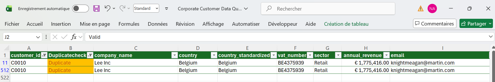
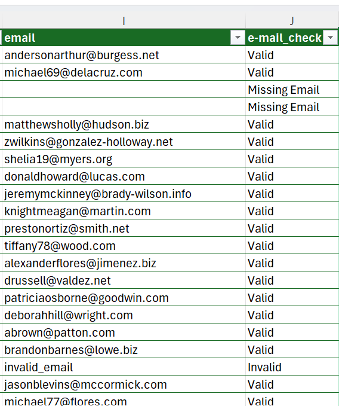
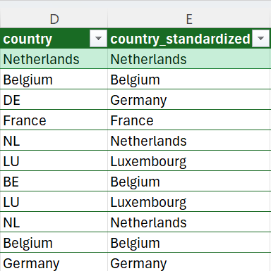
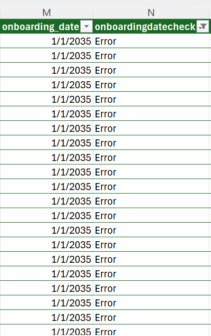
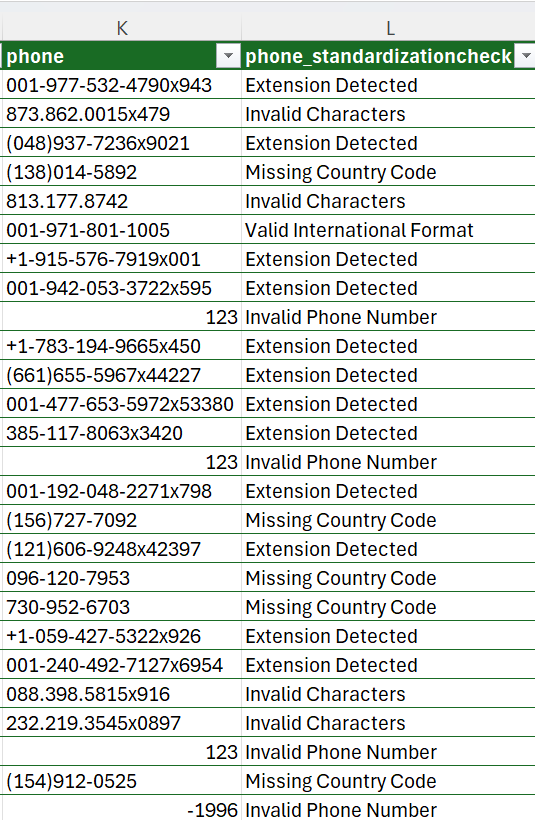

# Excel Data Quality Assessment

## Overview

This section contains the initial data quality assessment performed in Excel before integrating the dataset into PostgreSQL and Power BI.

---

## Quality Checks Performed

- Duplicate customer ID detection
- Missing value analysis
- Country standardization
- Invalid email identification

---

## Duplicate Customer ID Detection

A duplicate detection control was implemented using Excel formulas and conditional formatting.

### Findings

- 40 duplicate customer records identified

These duplicates may impact reporting consistency and customer monitoring processes.

### Duplicate Customer ID Detection

---

## Email Quality Validation

Email quality checks were performed to identify missing and invalid customer emails.

### Findings

- 76 invalid customer emails detected
- 37 missing customer emails
- 39 invalid email formats

These issues could negatively impact customer communication and reporting reliability.

### Email Quality Validation

---

## Country Standardization

The country column contains multiple naming variations representing the same country.

Examples:
- France / FR / French Republic
- Belgium / BE
- Germany / DE
- Luxembourg / LU
- Netherlands / NL

These inconsistencies can negatively impact:
- reporting accuracy
- customer segmentation
- dashboard consistency
- data governance processes

### Initial Findings Before Standardization

- Belgium: 95 records (BE = 49, Belgium = 46)
- Germany: 102 records (DE = 49, Germany = 53)
- France: 95 records (FR = 31, France = 26, French Republic = 38)
- Luxembourg: 117 records (LU = 54, Luxembourg = 63)
- Netherlands: 111 records (NL = 45, Netherlands = 66)

### Standardization Rules Applied

- FR and French Republic → France
- BE → Belgium
- DE → Germany
- LU → Luxembourg
- NL → Netherlands

### Country Standardization

---

## Date Validation

A date quality check identified 21 invalid onboarding dates out of 520 records.

These onboarding dates were set in the year 2035, which is inconsistent with the current business timeline and may indicate data entry or system integration issues.

### Onboarding Date Validation

---

## Phone Number Validation

Phone number quality checks were implemented to identify inconsistent international formats and invalid customer contact information.

### Findings

- 235 phone numbers contained extensions requiring standardization
- 89 phone numbers contained invalid characters
- 27 invalid phone numbers were identified
- 136 phone numbers were missing international country codes
- 33 phone numbers were already compliant with valid international formatting

These issues may negatively impact customer communication, operational workflows, and data consistency across reporting systems.

### Phone Number Validation

---

## Conclusion

This first phase of the project made it possible to identify several data quality issues within the customer dataset.  
Working directly in Excel helped highlight common problems that can affect reporting and daily operations, such as duplicate records, missing information, inconsistent country names, invalid emails, and non-standard phone numbers.

The analysis also showed how small inconsistencies can quickly impact the reliability of dashboards and customer monitoring processes if no controls are put in place.

Overall, this assessment provided a clearer view of the dataset quality and created a solid foundation for the next steps of the project, which will focus on SQL-based controls and Power BI monitoring.
