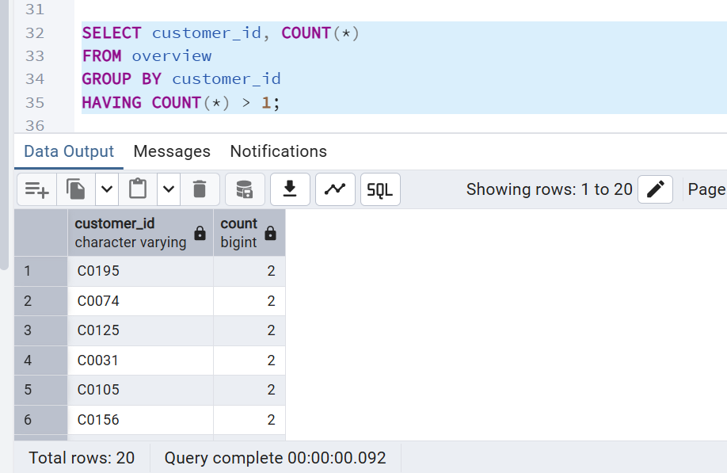
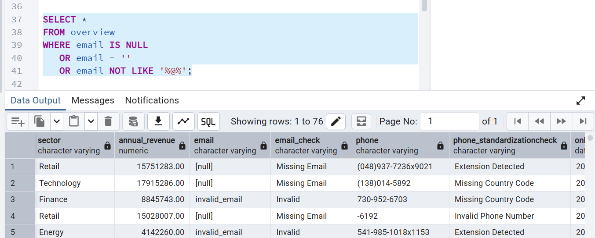
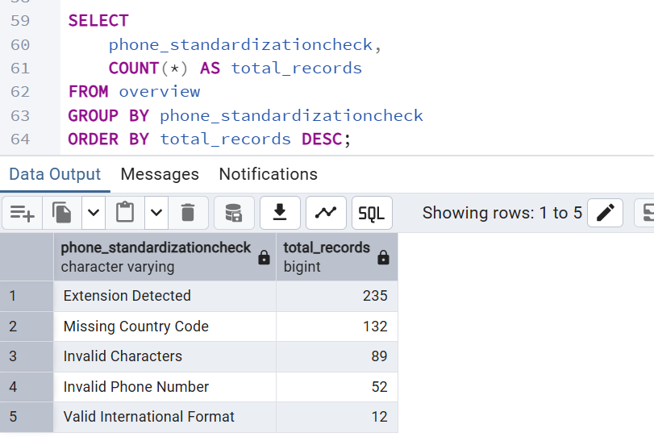

# PostgreSQL Data Quality Validation

## Overview

This section focuses on reproducing and automating the Excel-based data quality checks using PostgreSQL.

The objective was to identify customer data anomalies through SQL validation queries and prepare the dataset for future reporting and monitoring in Power BI.

The SQL workflow includes:
- duplicate customer detection
- invalid and missing email validation
- country standardization checks
- future onboarding date detection
- phone number quality monitoring

---

## Table Creation

The customer table was created using a structured PostgreSQL schema including customer master data and quality validation flags.

---

## Duplicate Customer Detection

SQL duplicate checks identified duplicated customer IDs within the dataset.

---

## Email Quality Validation

SQL validation queries were used to identify:
- missing emails
- invalid email formats

---

## Future Onboarding Date Validation

Date validation checks identified abnormal onboarding dates set in the future.

---

## Phone Number Quality Monitoring

Phone number quality checks identified:
- missing country codes
- invalid phone numbers
- invalid characters
- phone extensions
- inconsistent international formats

---

## Conclusion

The PostgreSQL workflow helped automate several critical data quality checks initially performed in Excel.

Using SQL validation queries improved anomaly detection, data monitoring capabilities, and overall data governance consistency across the customer dataset.
