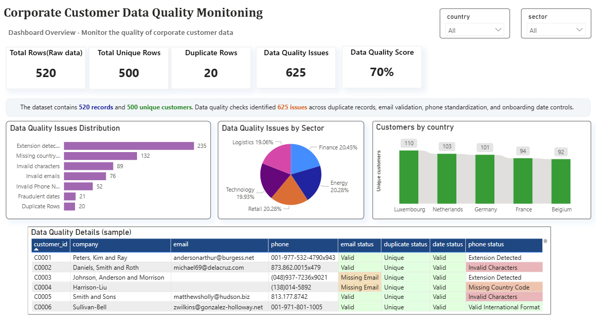

# Corporate-Customer-Data-Quality-Monitoring
Corporate customer data quality analysis and monitoring project using Excel, PostgreSQL, and Power BI.

## Project Overview

This project focuses on monitoring and improving the quality of corporate customer data.

The objective is to identify data quality issues that can negatively impact reporting, customer management, and business decision-making.

The project covers the complete analytical workflow:

- Data quality assessment in Excel
- Data cleaning and validation
- PostgreSQL data modeling
- Power BI dashboard development
- KPI creation and monitoring

---
## Business Problem

Poor data quality can lead to inaccurate reporting, duplicated customer records, ineffective customer communication, and unreliable business insights.

This project aims to identify and quantify data quality issues within a corporate customer database.

---

## Dataset

The dataset contains:

- 520 customer records
- 500 unique customers
- Multiple customer attributes including:
  - Customer ID
  - Company Name
  - Country
  - Sector
  - Email
  - Phone Number
  - Onboarding Date
  - Annual Revenue

---
## Data Quality Checks

The following quality controls were implemented:

### Customer ID Uniqueness
- Detection of duplicate customer IDs
- 20 duplicate records identified

### Email Validation
- Missing email detection
- Invalid email format detection

### Country Standardization
- Standardization of country names and abbreviations

### Onboarding Date Validation
- Detection of suspicious future dates

### Phone Number Standardization
- Missing country code detection
- Invalid character detection
- Invalid phone number detection
- Extension detection
---

## Tools Used

- Microsoft Excel
- PostgreSQL
- Power BI
- DAX

---

## Data Quality Score

A custom Data Quality Score was developed to evaluate overall dataset quality.

The score is based on four quality dimensions:

1. Customer ID Uniqueness
2. Email Validity
3. Onboarding Date Consistency
4. Phone Number Standardization

Formula:

Data Quality Score = 1 - (Total Issues / Maximum Possible Checks)

For this dataset:

- Total Records: 520
- Total Issues: 625
- Quality Controls: 4
- Maximum Possible Checks: 2,080

Final Data Quality Score: 70%

---

## Dashboard Overview

The Power BI dashboard provides:

- Data Quality Score monitoring
- Data quality issue distribution
- Issues by sector
- Customer distribution by country
- Detailed anomaly reporting

---

## Key Findings

- 625 data quality issues were identified
- Phone number issues represented the largest category of anomalies
- 20 duplicate customer records were detected
- The dataset achieved a Data Quality Score of 70%
- Customer data quality varied across sectors and countries

---

## Future Improvements

- Automated data quality monitoring
- Data quality alerts
- Trend analysis over time
- Integration with data governance processes

